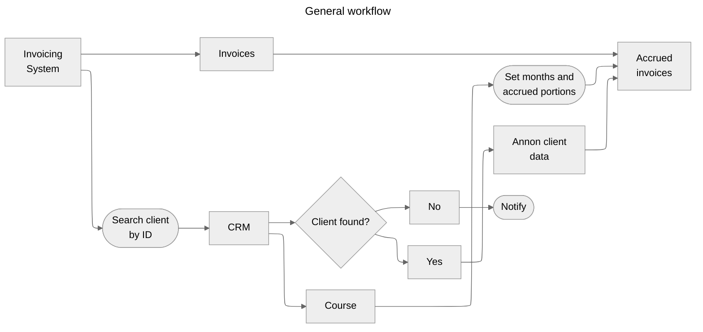
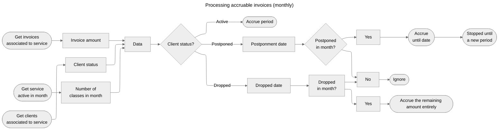

Devengo
========================

Tool to manage incomes and outcomes following the accrual principle.

Introduction
------------------------

> **Accrual** is an economic/accounting principle that states that transactions or economic events are recorded when they occur or when there is a firm commitment for them to happen, irrespective of the date of payment or collection, i.e., it is a right that is earned but not collected.

So, we must apply the accrual principle to the invoicing, not payments. This means that if a student enrolls in a 16-week program and pays today, but the cohort starts in two months, the economic event (the invoice, not the payment) must start in two months and be distributed over the four months of the course, depending on the number of classes.

### Premises

- Past months must not be altered.
- Holidays will not be taken into account in the class count.
- Credits must be accrued in the corresponding month.
- At the end of the accrual, the total invoiced minus credited must match all the money accrued.

### Cases to consider

- A person cancels the service:
  - Any amount remaining will be accrued that month.
- The start of a service is delayed
  - If someone has not started using the service, it shouldn't be processed until the service is re-assigned.
  - As the service has not started, there are no consequences, but the timetable must be updated to reflect the correct accrual.
- A person temporarily pauses the service:
  - The invoice(s) must accrue from the beginning of the service period until the last moment the person was active.
  - When the person resumes the service, the remaining amount (and, possibly, a re-enrollment fee) will be applied on the same basis in the new course period.
  - Any additional charges must be accrued in the new service period.
- A client ID from the invoice account doesn't match the CRM.
  - Provide a view with all the mismatches to offer an alternative ID in CRM to locate the client.

### Example

- Student:
  - Enrollment: Mar 4th
  - First payment: 50% on Mar 4th
  - Last payment: 50% on May 26th
- Course:
  - Cost: 500 €
  - Start: May 12th
  - End: August 27th
  - Classes per week: 2 (Mon, Wed) -> 32 classes per course

As the months have a different number of classes depending on their weeks, assuming there are no public holidays, the distribution of the course price would be:

|  Month               |  Classes  |   Portion    |  Accrued amount  |
|----------------------|:---------:|-------------:|-----------------:|
|  May (from 12th)     |     6     |    18,75%    |      93,75       |
|  June                |     9     |    28,125%   |     140,625      |
|  July                |     9     |    28,125%   |     140,625      |
|  August (until 27th) |     8     |    25,00%    |     125,00       |

Workflows
------------------------





Usage
------------------------

## Usage: Bulk Synchronization Script

The `sync-actions.py` script allows you to perform all the main data synchronization and accrual operations in sequence or individually, automating the workflow described above.

You can run the script from the command line:

```bash
pipenv sync-actions [OPTIONS]
```

### Options

- `--from-step <step>`: Start execution from a specific step, skipping all previous steps. Possible values:
  - `services` — Import Services from Invoicing System
  - `invoices` — Import Invoices and Clients from Invoicing System
  - `crm-clients` — Retrieve Clients data from CRM
  - `service-periods` — Generate Service Periods from CRM
  - `notion-external-id` — Sync Notion external IDs for clients
  - `accruals` — Only perform accruals for each month (skips all previous steps)
- `--year <year>`: Target year for processing (e.g., `2024`). Defaults to 2024 if not set. Ignored if `--start-date` and `--end-date` are provided.
- `--start-date <YYYY-MM-DD>`: Start date for processing (inclusive). If set, overrides `--year`.
- `--end-date <YYYY-MM-DD>`: End date for processing (exclusive). If set, overrides `--year`.

#### Examples

- Run all steps for the default year (2024):

  ```bash
  python src/api/scripts/sync-actions.py
  ```

- Start from importing invoices and clients:

  ```bash
  python src/api/scripts/sync-actions.py --from-step invoices
  ```

- Only perform accruals for each month in 2024:

  ```bash
  python src/api/scripts/sync-actions.py --from-step accruals
  ```

- Process a custom date range (e.g., from March to June 2024):

  ```bash
  python src/api/scripts/sync-actions.py --start-date 2024-03-01 --end-date 2024-07-01
  ```

### Environment Variables

- `VITE_API_URL`: Base URL for API calls (default: `http://localhost:3001`)

Main URLs
-------

1. Import Services from Invoicing System: `/api/integrations/holded/sync-services`
2. Import Invoices and Clients from Invoicing System: `/api/integrations/holded/sync-invoices-and-clients`
3. Retrieve Clients data from CRM: `/api/integrations/fourgeeks/sync-students-from-clients`
4. Generate Service Periods from CRM: `/api/integrations/fourgeeks/sync-enrollments-from-clients`
5. Generate the (current) Accrual Period: `/api/accruals/process-period`
