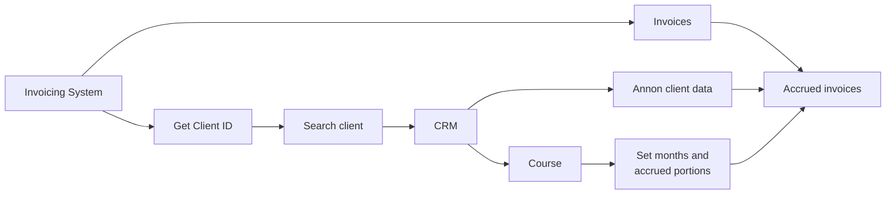

Devengo
========================
_Tool to manage incomes and outcomes following the accrual principle_

> **Accrual** is an economic/accounting principle that states that transactions or economic events are recorded when they occur or when there is a firm commitment for them to happen, irrespective of the date of payment or collection, i.e., it is a right that is earned but not collected.

So, we must apply the accrual principle to the invoicing, not payments. This means that if a student enrolls in a 16-week program and pays today, but the cohort starts in two months, the economic event (the invoice, not the payment) must start in two months and be distributed over the four months of the course, depending on the number of classes.

### Example
- Student:
  - Enrollment: Mar 4th
  - First payment: 50% on Mar 4th
  - Last payment: 50% on May 26th
- Course:
  - Cost: 500 €
  - Start: May 12th
  - End: August 27th
  - Classes per week: 2 (Mon, Wed) -> 32 classes per course

As the months have a different number of classes depending on their weeks, assuming there are no public holidays, the distribution of the course price would be:
|  Month               |  Classes  |   Portion    |  Accrued amount  |
|----------------------|:---------:|-------------:|-----------------:|
|  May (from 12th)     |     6     |    18,75%    |      93,75       |
|  June                |     9     |    28,125%   |     140,625      |
|  July                |     9     |    28,125%   |     140,625      |
|  August (until 27th) |     8     |    25,00%    |     125,00       |

_If there are public holidays on any class day, that class will not occur. In consequence, the end date would change; it would be later._

Workflows
========================
General workflow
------------------------

