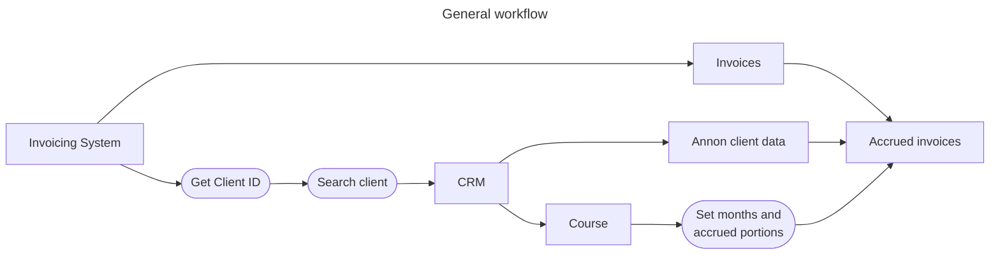

Devengo
========================
_Tool to manage incomes and outcomes following the accrual principle_

> **Accrual** is an economic/accounting principle that states that transactions or economic events are recorded when they occur or when there is a firm commitment for them to happen, irrespective of the date of payment or collection, i.e., it is a right that is earned but not collected.

So, we must apply the accrual principle to the invoicing, not payments. This means that if a student enrolls in a 16-week program and pays today, but the cohort starts in two months, the economic event (the invoice, not the payment) must start in two months and be distributed over the four months of the course, depending on the number of classes.

### Premises
- Past months must not be altered.
- Holidays will not be taken into account in the class count.
- Credits must be accrued in the corresponding month.
- At the end of the accrual, the total invoiced minus credited must match all the money accrued.

### Cases to consider
- A person stops the service (drops out):
  - Any amount remaining will be accrued that month.
- A person postpones the service:
  - The invoice must be accrued from the beginning of the service until the last moment the person was active.
  - When the person resumes the service, the remaining amount (and, possibly, a re-enrollment fee) will be applied following the same basis in the new course period.
- The start of a course is delayed
  - As the service has not started, there are no consequences, but the timetable must be updated for the correct accrual. 
 
### Example
- Student:
  - Enrollment: Mar 4th
  - First payment: 50% on Mar 4th
  - Last payment: 50% on May 26th
- Course:
  - Cost: 500 €
  - Start: May 12th
  - End: August 27th
  - Classes per week: 2 (Mon, Wed) -> 32 classes per course

As the months have a different number of classes depending on their weeks, assuming there are no public holidays, the distribution of the course price would be:
|  Month               |  Classes  |   Portion    |  Accrued amount  |
|----------------------|:---------:|-------------:|-----------------:|
|  May (from 12th)     |     6     |    18,75%    |      93,75       |
|  June                |     9     |    28,125%   |     140,625      |
|  July                |     9     |    28,125%   |     140,625      |
|  August (until 27th) |     8     |    25,00%    |     125,00       |

Workflows
========================

