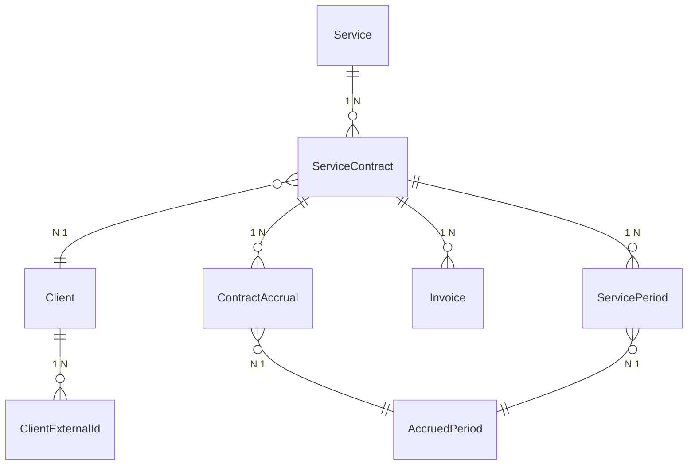

# Database Models Documentation

## Overview

This document describes all database models in the Devengo system, their relationships, fields, and usage patterns.

## Model Relationships Diagram



## Core Models

### Client

**Purpose**: Stores client information with encrypted personal data.

**Table**: `client`

**Fields**:

- `id` (int, PK): Primary key
- `encrypted_identifier` (str, indexed): Encrypted email/identifier
- `name` (str, optional): Client name
- `created_at` (datetime): Creation timestamp
- `updated_at` (datetime): Last update timestamp

**Properties**:

- `identifier` (property): Get/set decrypted identifier
- `get_external_id(system)` (method): Get external ID for a system

**Relationships**:

- `external_ids`: One-to-many with `ClientExternalId`
- `contracts`: One-to-many with `ServiceContract`

**Usage**:

```python
client = Client()
client.identifier = "user@example.com"  # Automatically encrypted
client.name = "John Doe"
```

### ClientExternalId

**Purpose**: Stores external system identifiers for clients.

**Table**: `clientexternalid`

**Fields**:

- `id` (int, PK): Primary key
- `client_id` (int, FK): Reference to Client
- `system` (str, indexed): System name (e.g., 'holded', 'fourgeeks', 'notion')
- `external_id` (str, indexed): External system identifier
- `created_at` (datetime): Creation timestamp
- `updated_at` (datetime): Last update timestamp

**Relationships**:

- `client`: Many-to-one with `Client`

**Usage**:

```python
external_id = ClientExternalId(
    client_id=client.id,
    system="holded",
    external_id="12345"
)
```

### Service

**Purpose**: Represents educational services (courses/programs).

**Table**: `service`

**Fields**:

- `id` (int, PK): Primary key
- `external_id` (str, optional, indexed): External service ID from 4Geeks
- `account_identifier` (str, optional, indexed): Account identifier from invoicing system
- `name` (str): Service name
- `description` (str, optional): Service description
- `service_type` (str, optional, indexed): Program type (FS, DS, CS)
- `total_sessions` (int, default=60): Total sessions in service
- `sessions_per_week` (int, default=3): Sessions per week
- `created_at` (datetime): Creation timestamp
- `updated_at` (datetime): Last update timestamp

**Properties**:

- `computed_service_type` (property): Get service type from stored value or compute from name

**Relationships**:

- `contracts`: One-to-many with `ServiceContract`

### ServiceContract

**Purpose**: Represents a client's contract for a service.

**Table**: `servicecontract`

**Fields**:

- `id` (int, PK): Primary key
- `service_id` (int, FK): Reference to Service
- `client_id` (int, FK): Reference to Client
- `contract_date` (date): Contract start date
- `contract_amount` (float): Total contract amount
- `contract_currency` (str, default="EUR"): Currency code
- `status` (ServiceContractStatus, indexed): Contract status (ACTIVE, CANCELED, CLOSED)
- `created_at` (datetime): Creation timestamp
- `updated_at` (datetime): Last update timestamp

**Relationships**:

- `service`: Many-to-one with `Service`
- `client`: Many-to-one with `Client`
- `invoices`: One-to-many with `Invoice`
- `periods`: One-to-many with `ServicePeriod`
- `contract_accrual`: One-to-one with `ContractAccrual`

**Status Values**:

- `ACTIVE`: Contract is active
- `CANCELED`: Contract was canceled
- `CLOSED`: Contract is closed/completed

### ServicePeriod

**Purpose**: Represents periods when a service contract is active, allowing pause/resume tracking.

**Table**: `serviceperiod`

**Fields**:

- `id` (int, PK): Primary key
- `external_id` (str, optional): External period ID
- `contract_id` (int, FK): Reference to ServiceContract
- `name` (str, optional): Period name/description
- `start_date` (date, indexed): Period start date
- `end_date` (date, indexed): Period end date
- `status` (ServicePeriodStatus, indexed): Period status
- `status_change_date` (date, optional): Date when status was last changed
- `created_at` (datetime): Creation timestamp
- `updated_at` (datetime): Last update timestamp

**Relationships**:

- `contract`: Many-to-one with `ServiceContract`
- `accruals`: One-to-many with `AccruedPeriod`

**Status Values**:

- `ACTIVE`: Period is currently active
- `POSTPONED`: Period is postponed/paused
- `DROPPED`: Student dropped out during this period
- `ENDED`: Period has ended normally

**Special Behavior**:

- `status_change_date` is automatically updated when status changes

### Invoice

**Purpose**: Stores invoice data from external invoicing systems.

**Table**: `invoice`

**Fields**:

- `id` (int, PK): Primary key
- `external_id` (str, unique, indexed): External invoice ID (from Holded)
- `client_id` (int, FK, optional): Reference to Client
- `invoice_number` (str): Invoice number
- `invoice_date` (date): Invoice date
- `due_date` (date, optional): Due date
- `total_amount` (float): Total invoice amount
- `currency` (str, default="EUR"): Currency code
- `status` (int): Invoice status (paid, pending, cancelled)
- `original_data` (JSON): Original invoice data from external system
- `service_contract_id` (int, FK, optional): Reference to ServiceContract
- `created_at` (datetime): Creation timestamp
- `updated_at` (datetime): Last update timestamp

**Relationships**:

- `client`: Many-to-one with `Client`
- `service_contract`: Many-to-one with `ServiceContract`

### ContractAccrual

**Purpose**: Tracks accrual status and amounts at the contract level.

**Table**: `contractaccrual`

**Fields**:

- `id` (int, PK): Primary key
- `contract_id` (int, FK, unique): Reference to ServiceContract (1:1)
- `total_to_accrue` (float): Total amount to accrue
- `remaining_amount_to_accrue` (float): Remaining amount to accrue
- `remaining_sessions_to_accrue` (int): Remaining sessions to accrue
- `accrual_status` (ContractAccrualStatus, indexed): Accrual status
- `created_at` (datetime): Creation timestamp
- `updated_at` (datetime): Last update timestamp

**Relationships**:

- `contract`: One-to-one with `ServiceContract`
- `accrued_periods`: One-to-many with `AccruedPeriod`

**Status Values**:

- `ACTIVE`: Accrual is active and ongoing
- `PAUSED`: Accrual is paused (e.g., postponed period)
- `COMPLETED`: Accrual is completed

**Usage**:

- Created automatically when a contract is processed for accrual
- Tracks progressive accrual from remaining amounts
- Updated each month as accruals are processed

### AccruedPeriod

**Purpose**: Individual monthly accrual records.

**Table**: `accruedperiod`

**Fields**:

- `id` (int, PK): Primary key
- `contract_accrual_id` (int, FK): Reference to ContractAccrual
- `service_period_id` (int, FK, optional): Reference to ServicePeriod (can be NULL)
- `accrual_date` (date, indexed): Date of accrual (first day of month)
- `accrued_amount` (float): Amount accrued in this period
- `sessions_accrued` (int): Number of sessions accrued
- `created_at` (datetime): Creation timestamp
- `updated_at` (datetime): Last update timestamp

**Relationships**:

- `contract_accrual`: Many-to-one with `ContractAccrual`
- `service_period`: Many-to-one with `ServicePeriod` (optional)

**Special Cases**:

- `service_period_id` can be NULL for final accruals without specific periods
- Used for monthly accrual tracking and reporting

## System Models

### SyncExecution

**Purpose**: Tracks synchronization execution for auditing and monitoring.

**Table**: `syncexecution`

**Fields**:

- `id` (int, PK): Primary key
- `step_name` (str, indexed): Sync step name
- `status` (str, indexed): Execution status
- `started_at` (datetime): Start timestamp
- `completed_at` (datetime, optional): Completion timestamp
- `error_message` (str, optional): Error message if failed
- `metadata` (JSON, optional): Additional execution metadata
- `created_at` (datetime): Creation timestamp
- `updated_at` (datetime): Last update timestamp

**Usage**:

- Created for each sync step execution
- Tracks success/failure and timing
- Used for monitoring and debugging

### IntegrationError

**Purpose**: Logs errors from external system integrations.

**Table**: `integrationerror`

**Fields**:

- `id` (int, PK): Primary key
- `integration_name` (str, indexed): Integration name (holded, fourgeeks, notion)
- `operation` (str, indexed): Operation that failed
- `entity_type` (str): Entity type (client, invoice, etc.)
- `entity_external_id` (str, indexed): External entity ID
- `error_message` (str): Error message
- `error_details` (JSON, optional): Detailed error information
- `status` (str, indexed): Error status (pending, resolved, ignored)
- `created_at` (datetime): Creation timestamp
- `updated_at` (datetime): Last update timestamp

**Usage**:

- Created when integration operations fail
- Tracks errors for resolution
- Supports filtering and CSV export

## Base Models

### BaseModel

**Purpose**: Base SQLModel class with common functionality.

**Fields**:

- Inherits from SQLModel
- Provides table configuration

### TimestampMixin

**Purpose**: Adds created_at and updated_at timestamps.

**Fields**:

- `created_at` (datetime): Creation timestamp
- `updated_at` (datetime): Last update timestamp

**Usage**:

- Mixed into all table models
- Automatically managed by SQLModel

## Enums and Constants

### ServiceContractStatus

- `ACTIVE`
- `CANCELED`
- `CLOSED`

### ServicePeriodStatus

- `ACTIVE`
- `POSTPONED`
- `DROPPED`
- `ENDED`

### ContractAccrualStatus

- `ACTIVE`
- `PAUSED`
- `COMPLETED`

## Data Integrity Rules

### Constraints

- `ClientExternalId`: Unique constraint on (client_id, system)
- `Invoice`: Unique constraint on external_id
- `ContractAccrual`: Unique constraint on contract_id (1:1 relationship)

### Cascades

- Deleting a Client cascades to ClientExternalIds and ServiceContracts
- Deleting a ServiceContract cascades to ServicePeriods and ContractAccrual
- Deleting a ContractAccrual cascades to AccruedPeriods

### Indexes

- Foreign keys are indexed for performance
- Date fields used in queries are indexed
- External IDs are indexed for lookup performance
- Status fields are indexed for filtering

## Encryption

### Encrypted Fields

- `Client.encrypted_identifier`: Client email/identifier encrypted at rest

### Encryption Utilities

- Located in `src/api/common/utils/encryption.py`
- Uses cryptography library
- Automatic encryption/decryption via properties

## Migration Management

### Alembic Migrations

- Located in `migrations/versions/`
- Versioned migrations with descriptive names
- Includes model changes, indexes, and constraints

### Migration Naming

Format: `YYYYMMDDHHMMSS-description.py`

Example: `20250320213412-002e53430f02_clients.py`
