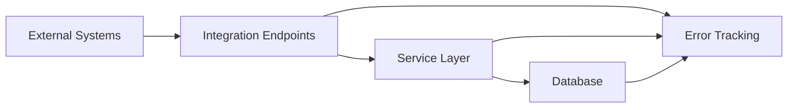

# External Integrations Documentation

## Overview

The Devengo system integrates with three external systems to synchronize data:

1. **Holded**: Invoicing system for services, invoices, and clients
2. **4Geeks CRM**: Student management and enrollment tracking
3. **Notion**: Client page ID synchronization

## Integration Architecture

### Integration Flow



### Error Handling

All integrations include comprehensive error tracking:

- **IntegrationError Model**: Logs all integration failures
- **Error Details**: Full error messages and HTTP responses
- **Status Tracking**: pending, resolved, ignored
- **CSV Export**: Export errors with filters for analysis

## Holded Integration

### Purpose

Synchronize services, invoices, and client data from the Holded invoicing system.

### Endpoints

#### Sync Services

**Endpoint**: `POST /api/integrations/holded/sync-services`

**Purpose**: Import services (courses/programs) from Holded.

**Process**:

1. Fetch services from Holded API
2. Match by `account_identifier`
3. Create or update Service records
4. Map service types (FS, DS, CS) from service names

**Data Mapped**:

- Service name
- Account identifier
- Service type (computed from name)
- External ID

#### Sync Invoices and Clients

**Endpoint**: `POST /api/integrations/holded/sync-invoices-and-clients`

**Purpose**: Import invoices and associated clients from Holded.

**Parameters**:

- `start_date` (optional): Start date for invoice filtering
- `end_date` (optional): End date for invoice filtering

**Process**:

1. Fetch invoices from Holded API (filtered by date range)
2. For each invoice:
   - Extract client information
   - Create or update Client record
   - Create ClientExternalId for Holded system
   - Create or update Invoice record
   - Attempt to match invoice to ServiceContract

**Data Mapped**:

- Invoice: number, date, amount, status, external ID
- Client: identifier (email), name
- ClientExternalId: system='holded', external_id

**Matching Logic**:

- Match invoices to ServiceContracts by:
  - Client matching
  - Service matching
  - Date ranges
  - Amount matching

**Error Handling**:

- Logs errors for unmatched invoices
- Tracks client creation failures
- Records invoice matching issues

## 4Geeks CRM Integration

### Purpose

Synchronize student data and enrollments (service periods) from the 4Geeks CRM system.

### Endpoints

#### Sync Students from Clients

**Endpoint**: `POST /api/integrations/fourgeeks/sync-students-from-clients`

**Purpose**: Import student/client data from 4Geeks CRM.

**Parameters**:

- `start_date` (optional): Start date for filtering
- `end_date` (optional): End date for filtering

**Process**:

1. Fetch students from 4Geeks API
2. Match students to existing Clients by:
   - Email matching
   - External ID matching
3. Update Client records with:
   - Name
   - ClientExternalId for 'fourgeeks' system
4. Create new Clients if not found

**Data Mapped**:

- Client: name, identifier (email)
- ClientExternalId: system='fourgeeks', external_id

**Matching Strategy**:

- Primary: Email matching
- Secondary: External ID matching
- Fallback: Create new client

#### Sync Enrollments from Clients

**Endpoint**: `POST /api/integrations/fourgeeks/sync-enrollments-from-clients`

**Purpose**: Import enrollments (service periods) from 4Geeks CRM.

**Parameters**:

- `start_date` (optional): Start date for enrollment filtering
- `end_date` (optional): End date for enrollment filtering

**Process**:

1. Fetch enrollments from 4Geeks API
2. Match enrollments to:
   - Client (by external ID)
   - Service (by external ID)
   - ServiceContract (by client + service)
3. Create or update ServicePeriod records:
   - Period name
   - Start and end dates
   - Status (ACTIVE, POSTPONED, DROPPED, ENDED)
   - Status change date

**Data Mapped**:

- ServicePeriod: name, start_date, end_date, status, status_change_date
- Links to ServiceContract and Client

**Status Mapping**:

- Active enrollment → ACTIVE
- Paused enrollment → POSTPONED
- Dropped enrollment → DROPPED
- Completed enrollment → ENDED

**Error Handling**:

- Logs errors for unmatched enrollments
- Tracks missing client/service relationships
- Records status mapping issues

## Notion Integration

### Purpose

Synchronize client page IDs from Notion for client management.

### Endpoints

#### Sync Page IDs

**Endpoint**: `POST /api/integrations/notion/sync-page-ids`

**Purpose**: Import Notion page IDs for clients.

**Process**:

1. Fetch clients from Notion API
2. Match Notion pages to Clients by:
   - Email matching
   - Name matching
   - Existing external ID matching
3. Create or update ClientExternalId records:
   - system='notion'
   - external_id=page_id

**Data Mapped**:

- ClientExternalId: system='notion', external_id (page_id)

**Matching Strategy**:

- Email matching (primary)
- Name matching (secondary)
- External ID matching (fallback)

**Error Handling**:

- Improved error capture with full HTTP/Notion messages
- Error details include complete API response
- Error message contains full error context

## Integration Error Management

### IntegrationError Model

**Fields**:

- `integration_name`: System name (holded, fourgeeks, notion)
- `operation`: Operation that failed
- `entity_type`: Type of entity (client, invoice, enrollment)
- `entity_external_id`: External entity identifier
- `error_message`: Error message
- `error_details`: JSON with detailed error information
- `status`: Error status (pending, resolved, ignored)

### Error Tracking Endpoints

#### List Integration Errors

**Endpoint**: `GET /api/integrations/errors`

**Query Parameters**:

- `integration_name` (optional): Filter by integration
- `operation` (optional): Filter by operation
- `status` (optional): Filter by status
- `entity_type` (optional): Filter by entity type
- `limit` (optional): Limit results (default: 100, max: 1000)

**Response**: List of integration errors with filters applied

#### Export Errors CSV

**Endpoint**: `GET /api/integrations/errors/export/csv`

**Query Parameters**: Same as list endpoint

**Response**: CSV file with error data

**CSV Columns**:

- Date (merged from created_at)
- Integration/Operation (merged column)
- Entity external ID
- Error Message
- Error Details (expandable)
- Status

#### Update Error Status

**Endpoint**: `PATCH /api/integrations/errors/{error_id}`

**Body**:

```json
{
  "status": "resolved" | "ignored"
}
```

#### Bulk Update Error Status

**Endpoint**: `PATCH /api/integrations/errors/bulk-update`

**Body**:

```json
{
  "error_ids": [1, 2, 3],
  "status": "resolved" | "ignored"
}
```

## Synchronization Management

### Sync Steps

The system supports orchestrated synchronization through these steps:

1. **services**: Sync services from Holded
2. **invoices**: Sync invoices and clients from Holded
3. **crm-clients**: Sync students from 4Geeks CRM
4. **service-periods**: Sync enrollments from 4Geeks CRM
5. **notion-external-id**: Sync Notion page IDs
6. **accruals**: Process accruals (separate from import steps)

### Sync Execution

**Endpoint**: `POST /api/sync/execute-step`

**Body**:

```json
{
  "step_name": "services" | "invoices" | "crm-clients" | "service-periods" | "notion-external-id" | "accruals",
  "year": 2024,
  "start_date": "2024-03-01",
  "end_date": "2024-07-01"
}
```

**Process**:

1. Create SyncExecution record
2. Execute integration endpoint
3. Update SyncExecution with results
4. Return execution status

### Sync Script

**Script**: `src/api/scripts/sync-actions.py`

**Usage**:

```bash
python src/api/scripts/sync-actions.py [OPTIONS]
```

**Options**:

- `--from-step <step>`: Start from specific step
- `--year <year>`: Target year
- `--start-date <YYYY-MM-DD>`: Start date (first of month)
- `--end-date <YYYY-MM-DD>`: End date (first of month, exclusive)

**Example**:

```bash
# Sync invoices for March through June 2024
python src/api/scripts/sync-actions.py --from-step invoices --start-date 2024-03-01 --end-date 2024-07-01

# Process accruals for entire year
python src/api/scripts/sync-actions.py --from-step accruals --year 2024
```

## API Authentication

### Holded API

- API key authentication
- Base URL configured in environment variables
- Rate limiting considerations

### 4Geeks API

- Token-based authentication
- Base URL configured in environment variables
- Pagination support

### Notion API

- Token-based authentication
- API version specified in headers
- Rate limiting considerations

## Data Consistency

### Matching Strategies

#### Client Matching

1. **Email matching**: Primary strategy
2. **External ID matching**: Secondary strategy
3. **Name matching**: Fallback strategy
4. **Create new**: If no match found

#### Service Matching

1. **Account identifier matching**: Primary strategy
2. **External ID matching**: Secondary strategy
3. **Name matching**: Fallback strategy

#### Contract Matching

1. **Client + Service matching**: Primary strategy
2. **Date range matching**: Secondary strategy
3. **Amount matching**: Tertiary strategy

### Conflict Resolution

- **Duplicate External IDs**: Update existing records
- **Conflicting Data**: Log as integration errors
- **Missing Relationships**: Create placeholder records or log errors

## Monitoring and Debugging

### Sync Execution Tracking

- All sync executions are logged in `SyncExecution` table
- Includes timing, status, and error information
- Used for monitoring sync health

### Error Analysis

- Integration errors can be filtered and exported
- Error details include full API responses
- Status tracking for error resolution

### Logging

- Structured logging for all integration operations
- Includes entity IDs, external IDs, and operation context
- Error logging with full stack traces

## Best Practices

### Date Range Filtering

- Always use first day of month for start_date
- End_date is exclusive (not included in range)
- Example: `start_date=2024-03-01, end_date=2024-07-01` processes March-June

### Error Handling

- Always check integration errors after sync
- Resolve or ignore errors promptly
- Use CSV export for bulk error analysis

### Sync Order

- Follow fixed execution order:
  1. services
  2. invoices
  3. crm-clients
  4. service-periods
  5. notion-external-id
  6. accruals (separate step)

### Performance

- Use date ranges to limit sync scope
- Process in batches for large datasets
- Monitor sync execution times
