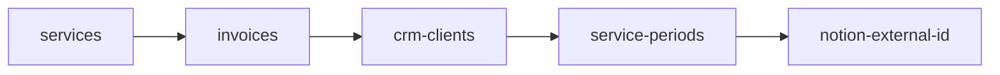

# Sync Management System Documentation

## Overview

The Sync Management System provides orchestration and execution tracking for data synchronization operations across external systems. It coordinates the import of data from Holded, 4Geeks CRM, and Notion, and manages the accrual processing workflow.

## Architecture

### Components

```text
SyncManagementService (Service Layer)
├── execute_step() - Execute individual sync step
├── get_available_steps() - List available steps
├── get_execution_order() - Get fixed execution order
└── get_steps_from_starting_point() - Get steps from starting point

SyncExecution (Model)
├── step_name - Sync step identifier
├── status - Execution status
├── started_at - Start timestamp
├── completed_at - Completion timestamp
└── error_message - Error if failed

SyncManagement Endpoints
├── GET /api/sync/available-steps - List available steps
├── GET /api/sync/execution-order - Get execution order
└── POST /api/sync/execute-step - Execute sync step
```

## Sync Steps

### Import Steps

These steps import data from external systems:

#### 1. services

- **Name**: Sync Services
- **Description**: Import services from Holded
- **Endpoint**: `/api/integrations/holded/sync-services`
- **Purpose**: Import educational services (courses/programs) from invoicing system

#### 2. invoices

- **Name**: Sync Invoices
- **Description**: Import invoices and clients from Holded
- **Endpoint**: `/api/integrations/holded/sync-invoices-and-clients`
- **Purpose**: Import invoices and associated client data
- **Parameters**: `start_date`, `end_date` (optional)

#### 3. crm-clients

- **Name**: Sync CRM Clients
- **Description**: Import students from 4Geeks clients
- **Endpoint**: `/api/integrations/fourgeeks/sync-students-from-clients`
- **Purpose**: Import student/client data from CRM
- **Parameters**: `start_date`, `end_date` (optional)

#### 4. service-periods

- **Name**: Sync Service Periods
- **Description**: Import enrollments from 4Geeks clients
- **Endpoint**: `/api/integrations/fourgeeks/sync-enrollments-from-clients`
- **Purpose**: Import service periods (enrollments) from CRM
- **Parameters**: `start_date`, `end_date` (optional)

#### 5. notion-external-id

- **Name**: Sync Notion External IDs
- **Description**: Import page IDs from Notion clients
- **Endpoint**: `/api/integrations/notion/sync-page-ids`
- **Purpose**: Import Notion page IDs for client management

### Accrual Step

#### 6. accruals

- **Name**: Process Accruals
- **Description**: Process contract accruals for the specified period
- **Endpoint**: `/api/accruals/process-contracts`
- **Purpose**: Process monthly accruals for contracts
- **Parameters**: `period_start_date` (required)

**Note**: Accruals step is separate from import steps and can be run independently.

## Execution Order

### Fixed Order

The import steps have a fixed execution order:



This order ensures:

1. Services exist before creating contracts
2. Invoices exist before matching to contracts
3. Clients exist before creating periods
4. Periods exist before processing accruals
5. External IDs are synced last for completeness

### Starting from a Step

You can start execution from any step using `--from-step`:

```bash
# Start from invoices step (skips services)
python src/api/scripts/sync-actions.py --from-step invoices
```

This executes: `invoices → crm-clients → service-periods → notion-external-id`

## API Endpoints

### Get Available Steps

**Endpoint**: `GET /api/sync/available-steps`

**Response**:

```json
{
  "import_steps": [
    {
      "id": "services",
      "name": "Sync Services",
      "description": "Import services from Holded"
    },
    ...
  ],
  "accrual_steps": [
    {
      "id": "accruals",
      "name": "Process Accruals",
      "description": "Process contract accruals for the specified period"
    }
  ]
}
```

### Get Execution Order

**Endpoint**: `GET /api/sync/execution-order`

**Response**:

```json
["services", "invoices", "crm-clients", "service-periods", "notion-external-id"]
```

### Execute Sync Step

**Endpoint**: `POST /api/sync/execute-step`

**Request Body**:

```json
{
  "step_name": "invoices",
  "year": 2024,
  "start_date": "2024-03-01",
  "end_date": "2024-07-01"
}
```

**Parameters**:

- `step_name` (required): Step identifier
- `year` (optional): Target year (defaults to 2024)
- `start_date` (optional): Start date (YYYY-MM-DD, must be first of month)
- `end_date` (optional): End date (YYYY-MM-DD, must be first of month, exclusive)

**Response**:

```json
{
  "step_name": "invoices",
  "status": "completed",
  "started_at": "2024-02-17T10:00:00Z",
  "completed_at": "2024-02-17T10:05:00Z",
  "execution_id": 123,
  "result": {
    "invoices_processed": 150,
    "clients_created": 25,
    "clients_updated": 125
  }
}
```

## Sync Script

### Script Location

`src/api/scripts/sync-actions.py`

### Usage

```bash
python src/api/scripts/sync-actions.py [OPTIONS]
```

### Options

#### --from-step <step>

Start execution from a specific step, skipping all previous steps.

**Values**:

- `services` - Import Services from Invoicing System
- `invoices` - Import Invoices and Clients from Invoicing System
- `crm-clients` - Retrieve Clients data from CRM
- `service-periods` - Generate Service Periods from CRM
- `notion-external-id` - Sync Notion external IDs for clients
- `accruals` - Only perform accruals (skips all import steps)

#### --year `<year>`

Target year for processing (e.g., `2024`). Defaults to 2024 if not set. Ignored if `--start-date` and `--end-date` are provided.

#### --start-date `<YYYY-MM-DD>`

Start date for processing (inclusive). Must be the first day of a month (YYYY-MM-01). If set, overrides `--year`.

#### --end-date `<YYYY-MM-DD>`

End date for processing (exclusive, not included). Must be the first day of a month (YYYY-MM-01). If set, overrides `--year`.

### Examples

#### Run All Steps for Default Year

```bash
python src/api/scripts/sync-actions.py
```

#### Sync Invoices for Date Range

```bash
python src/api/scripts/sync-actions.py --from-step invoices --start-date 2024-03-01 --end-date 2024-07-01
```

This processes invoices for:

- March 2024 (2024-03-01 to 2024-04-01)
- April 2024 (2024-04-01 to 2024-05-01)
- May 2024 (2024-05-01 to 2024-06-01)
- June 2024 (2024-06-01 to 2024-07-01)

**Note**: July is NOT processed because `--end-date` is exclusive.

#### Run Accruals for Date Range

```bash
python src/api/scripts/sync-actions.py --from-step accruals --start-date 2024-03-01 --end-date 2024-07-01
```

This processes accruals for:

- March 2024 (2024-03-01)
- April 2024 (2024-04-01)
- May 2024 (2024-05-01)
- June 2024 (2024-06-01)

#### Run Accruals for Single Month

```bash
python src/api/scripts/sync-actions.py --from-step accruals --start-date 2024-03-01 --end-date 2024-04-01
```

#### Complete Workflow Example

Sync invoices and then run accruals for the same date range:

```bash
# Step 1: Sync invoices for March through June 2024
python src/api/scripts/sync-actions.py --from-step invoices --start-date 2024-03-01 --end-date 2024-07-01

# Step 2: Run accruals for the same period
python src/api/scripts/sync-actions.py --from-step accruals --start-date 2024-03-01 --end-date 2024-07-01
```

## Execution Tracking

### SyncExecution Model

**Fields**:

- `id`: Primary key
- `step_name`: Sync step identifier
- `status`: Execution status (pending, running, completed, failed)
- `started_at`: Start timestamp
- `completed_at`: Completion timestamp
- `error_message`: Error message if failed
- `metadata`: JSON with additional execution data
- `created_at`: Creation timestamp
- `updated_at`: Last update timestamp

### Execution Flow

1. **Create SyncExecution**: Record created with status='pending'
2. **Start Execution**: Status updated to 'running', started_at set
3. **Execute Step**: Call appropriate integration endpoint
4. **Complete**: Status updated to 'completed', completed_at set, result stored in metadata
5. **Error Handling**: If error occurs, status updated to 'failed', error_message set

### Monitoring

- All executions are logged in `SyncExecution` table
- Can query by step_name, status, date range
- Used for monitoring sync health and debugging

## Date Range Processing

### Monthly Processing

When processing date ranges, the system processes each month individually:

**Example**: `start_date=2024-03-01, end_date=2024-07-01`

Processes:

- March 2024: 2024-03-01 to 2024-04-01
- April 2024: 2024-04-01 to 2024-05-01
- May 2024: 2024-05-01 to 2024-06-01
- June 2024: 2024-06-01 to 2024-07-01

**Note**: July is NOT processed because end_date is exclusive.

### Accrual Processing

For accruals, each month is processed with `period_start_date` set to the first day of the month:

- March: `period_start_date=2024-03-01`
- April: `period_start_date=2024-04-01`
- May: `period_start_date=2024-05-01`
- June: `period_start_date=2024-06-01`

## Error Handling

### Step Execution Errors

- Errors are caught and logged in SyncExecution
- Error message stored in `error_message` field
- Status set to 'failed'
- Execution continues for other steps if in batch

### Integration Errors

- Integration errors are logged in `IntegrationError` table
- Can be viewed and exported via Integration Errors UI
- Errors don't stop sync execution (non-blocking)

## Frontend Integration

### SyncManagement Component

**Location**: `src/client/components/SyncManagement.tsx`

**Features**:

- Display available sync steps
- Execute sync steps with date range selection
- Show execution status and results
- Display execution history
- Error handling and notifications

**Usage**:

- Select step from dropdown
- Choose date range (year or custom dates)
- Click "Execute" to run sync
- View results and execution history

## Best Practices

### Execution Order

Always follow the fixed execution order for import steps:

1. services
2. invoices
3. crm-clients
4. service-periods
5. notion-external-id

### Date Ranges

- Use first day of month for start_date and end_date
- Remember end_date is exclusive
- Use same date range for invoices and accruals for consistency

### Error Monitoring

- Check SyncExecution records after sync
- Review IntegrationError records for integration issues
- Resolve errors before next sync cycle

### Performance

- Use date ranges to limit sync scope
- Process accruals separately from imports
- Monitor execution times for performance issues

### Incremental Syncs

- Use `--from-step` to skip already-processed steps
- Use date ranges to sync only new data
- Process accruals monthly after data sync
